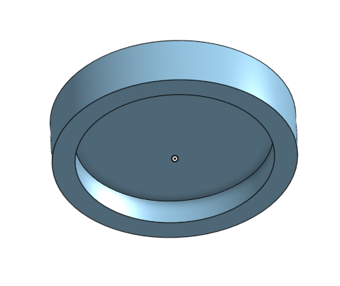

# Circles 

If you want to follow along in the parts studio, here is a link to my [original document](https://cvilleschools.onshape.com/documents/18c55e9aeb64057e8e0fbb6a/w/5c06b8e3c4dcf6e948152fa4/e/18df3578f02c775cfcadaef9?configuration=List_8xTqWDMkkCG2Mw%3D_2x2%3BList_ArQ6GsCPNSkQoQ%3DDefault%3BList_Izy0ldJ6UfParG%3DDefault%3BList_tmPjPdZ9wrB2lD%3DDefault&renderMode=0&uiState=6290d24be366b652b2773d0f). Navigate to the Round Square and Axel part studio. You might have to navigate to all tabs first because I'm pretty sure the link puts you into the square bricks folder. Change the configuration to Block Type: Plate, Size: 2x2, and Quarter/Half: Full. 

### The Brick Goes South 

Here is the [Brick](https://www.bricklink.com/v2/catalog/catalogitem.page?P=4032#T=C) we are talking about. 

Ok we're about to make the brick that gave me the most grief in my time building legos. I struggled for an unreasable amount of time trying to make these 8 bricks contained within this parts studio. 

This is mainly due to a lot of redesigns, but also a fatal flaw I had when designing these parts that I hope you reading this don't fall into. 

#### I tried too hard to make the Legos accurate. 

At a certain point you have to go with functionality over form which was the most important lesson I learned while building these legos. 

Your legos need to be functional first and look like the lego second. Sometimes you just need something to work and if it's not 100% accurate that completely fine. 

As long as it does everything the original lego can do, you have succeded. 

### Another Lesson 

The other lesson I learned was that the USE Relation sucks!!!

Use is great tool, but IT DOES NOT WORK WITH CONFIGURATIONS, or at least, it doesn't work very well. 

Let me give you an example:

I'm making a [6x6 circle brick](https://www.bricklink.com/v2/catalog/catalogitem.page?P=11213#T=C), and suddenly I relize that I've need to change the tube width on part of the brick cause something was wrong. 

I've been using the Use relation to determine the postion of the new tubes added from the [4x4 circle](https://www.bricklink.com/v2/catalog/catalogitem.page?P=60474#T=C).

I change the variable and suddenly everything breaks. 

I was never fully sure what would break the use function, but basically if you change something earlier in the parts studio the Use Relation will sometimes determine that this is infact a new entity and when you switch configuarions everything breaks. 

I made the same set of tubes for the Circles maybe three or four times. 

The best way to fix this is to just use the Use Relation as little as possible when dealing with configurations. Things will probably break and when they do figure out what it was and then remake that section without the Use Relation 

Anyway lets actually start with the Guide. 

This is the Guide for the [2x2](https://www.bricklink.com/v2/catalog/catalogitem.page?P=4032#T=C) and [4x4](https://www.bricklink.com/v2/catalog/catalogitem.page?P=60474#T=C). If you want to make the [6x6](https://www.bricklink.com/v2/catalog/catalogitem.page?P=11213#T=C) and [8x8](https://www.brickowl.com/catalog/lego-plate-8-x-8-circle-74611) be my guest. 

### Guide to 2x2 

Alright first we're going to make a circle that 16mm in diameter. I made a Variable called RowsandColumns to help me keep track of things.  

So the circle should actually be dimensioned RowsandColumns * 8mm 

Extrude that circle out #Height which in this guide is (10/3)mm 

Now use the shell feature on the bottom of your disk and set Shell thickness to #Unit or 1.5mm

Alright now we're going to make a rather complicated sketch. 

when making normal legos you just make a single stud and then pattern that out, but through some trial and error I felt that it was ultimately easier to make a set of four studs and pattern those out. 

For future parts the circle gets larger in all directions so the we're going to need several patterns anyway, and on bricks like the [6x6](https://www.bricklink.com/v2/catalog/catalogitem.page?P=11213#T=C), we don't actually want the pattern to fill in a lot of the studs 

As you can see from my beautiful drawing. Using a normal pattern would fill in those places with the red circles. 

Also because the original stud would be off center but also in the middle. All the Patterns would have to be configured with different variables which would get confusing really fast 

Anyway all that to say we're about to make a weird sketch. 

Alright so first we're going to make two construction lines passing through the origin and connecting touching the two sides of the circle. One Verticle and One Horizontal. 

Next we're going to make a square on construction lines. The sides of the square should be #Unit away from the points where the first construction lines meet the circle. 

Now make a center circle and make it's two edges tangent to the top and left construction lines of the square. 

Dimension it to be 5mm.

Then make 3 more equal circles in the other corners. Instead of making them tangent just make them so that the centers are #Length or 8mm away. 

Now extrude add the circles #Stud_Height or 1.8mm 

You'll notice that a small part of the studs have been cut off. This is intentional.

Now we're going to make a hole in the middle of our part. 

Sketch on the top face of the part and make the Axel sketch from the [Technic Guide](Technic.md)

We're also going to make a second circle thats dimensioned 6.5mm 

Extrude remove the axel sketch and extrude add the tube made by the 5mm circle of the axel sketch and the new 6.5mm circle 

Finally we're going to make a sketch on the very bottom of the brick. 

Not inside on the hollow, but on the edge

Sketch a horizontal line on the top of lip and make it tangent to the inside edge of the lip.

Repeat this on the bottom of the lip and on the sides with verticle lines. 

Your sketch should look something like this:

Extrude remove the weird looking sections that aren't part of the semi-circles that were created by your lines 

Yay! Now you have a super cool part 

# Guide to 4x4 

If you're following along with the document change the Size Configuration to 4x4 

### Lettuce Begin 

Alright first things first, we need to configure some things. 

We're going to create a configurations table called size. 

Name one of them 2x2 and the other 4x4 

Keep all the 2x2 features the same, and change them only for the 4x4. 

The Features we're are going to configure are: 

- Change #RowsandColumns to 4
- Change the shell thickness of the shell from #Unit to #Half_Unit 
- Suppress the extrude remove that removes sections of the bottom lip

We're going to be coming back to the configurations later. 

Currently your part should look like this:

Alright First I would make a sketch and just draw two lines with end points at the origin. One Verticle One Horizontal. 

These are just references for the patterns we're about to make

The first pattern is verticle. 

Select the four studs. Make distance #Width or 8mm, Set instances as 2, and click the box next to centered to make it symmetric. 

Use the reference sketch we just made as the direction 

Now for the other pattern. 

Once again we're making two seperate patterns so that it doesn't fill in the stud where we don't need them 

Just do the exact same thing but make the pattern horizontal 

Now go into the configuration table and configure the instances for both patterns. 

For the 2x2 row change the instances from 2 to 1 for both patterns 

Now we're going to make the tubes 

