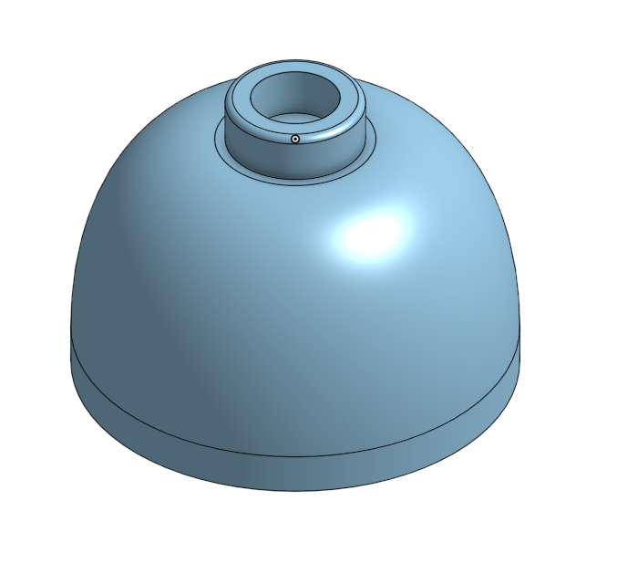

# Dome 

If you want to follow along in the parts studio, here is a link to my [original document](https://cvilleschools.onshape.com/documents/18c55e9aeb64057e8e0fbb6a/w/5c06b8e3c4dcf6e948152fa4/e/18df3578f02c775cfcadaef9?configuration=List_8xTqWDMkkCG2Mw%3D_2x2%3BList_ArQ6GsCPNSkQoQ%3DDefault%3BList_Izy0ldJ6UfParG%3DDefault%3BList_tmPjPdZ9wrB2lD%3DDefault&renderMode=0&uiState=6290d24be366b652b2773d0f). Navigate to the part studio called Weird Dome. The link puts you into the square bricks folder so youre going to want to go to home first. 

## Lets Begin 

You're going to want to make a new parts studio for this one because it's ver different from your normal brick. 

I debated whether or not I should include this one because its not a very common brick and doesn't share much with any other bricks, but I think it's probably important to learn just because of how weird it is. 

### 2x2 Dome 

This is the [Brick](https://www.bricklink.com/v2/catalog/catalogitem.page?P=553b#T=C) we're talking about

#### Disclaimer: This part is a bunch of nonsense numbers. Making legos is a bunch of trial and error because there are no offical dimensions for legos. Don't ask how I got the numbers I did because I really don't remember. 

First make a sketch on the front plane. Make a corner rectangle from the origin and delete the top line. 

Dimension the verticle lines to be #Height(9.7mm) - #Unit(1.5mm). I'll explain why later. 

Dimension the horizontal line to be #Length(8mm)

Now make a new top line but don't just connect it to the right side line. Instead dimension it to be (5mm + (#Unit/2))/2. Just copy the equation and drop it into onshape. 

Now make a conic arc from the bottom right corner to the end of the top line. Attach it's little arc point to the top of the right line and dimension the arc to be 0.45.

Revolve the sketch around the origin mate connector. (If you're following along with the document you'll notice I have an extra sketch and did a sweep instead of a revolve. I honestly have no idea why I choose to do that but a revolve is easier) 

Now select the bottom face and select hollow. Set the Shell thickness to #Unit(1.5mm) 

Now make a sketch on the bottom face of the dome and make a circle dimensioned to 16mm. Extrude the whole circle #Unit(1.5mm). This extrude should fully cover the opening you just made which I know seems counter-intuitive, but it's necessary for the creating the tube later. 

Now flip your part over and make a sketch on the top of the dome. Make two circles centered on the top of the dome: one dimensioned to be #Rod_Thickness(3.2mm) and the other dimensioned to be #Tube_Width(5mm). Then extrude out the space between the two #Stud_Height(1.8mm). 

Boom. You gotta a Stud. You can also throw on a 0.25mm fillet to the outside edge of the stud to make it look nicer and make assembly easier. 

Alright now I'm going to show you a little trick thats necessary to make this part work. 

Right click the bottom face of the dome and create a section view.

Click on the arrow and drag it up into the part. Leave the top half the the part visible. You'll notice that we are now able to select thing inside the part. 

Select top of the inside of the dome and make a sketch. 

## Reflection 

### 2x2 Dome 

So the Domes comes in three sections: 

1. The stud on the top
2. The dome section 
3. The stud connection points 

The reason that the dome is dimensioned to a height of #Height(9.7mm) - #Unit(1.5mm) is because otherwise the dome would be an extra #Unit(1.5mm) tall. For most bricks the main section of the brick and a connector points are one and the same with a total height of #Height(9.7mm), but with the dome those are two seperate features because it's very hard to work with curves in onshape. 

I was initially confused as to why I had made the bottom connector points soild. Turns out I did have a reason because it breaks if I change it. In simple terms it was necessary because the central tube is a loft and you need two faces to select for a loft. It's weird and dumb and took me several attempts but it works; which is the best way to summerize most of my projects. 

