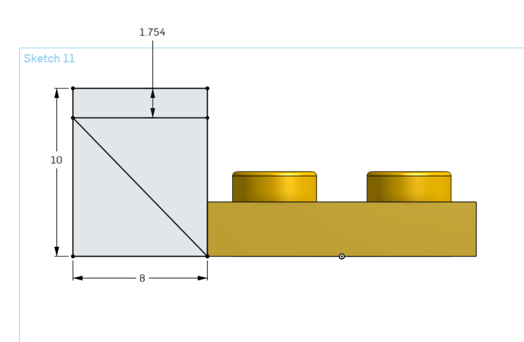

# Guide to Legos

by Ben Wright 

### Getting Started 

If you're here I'm going to assume you've already gone through the onshape tutorial for how to build a basic brick. If you haven't you can find it [here](https://cvilleschools.onshape.com/documents/d2d156bfb1db472973063473/w/2ec44ccdcd6dacf683eb0c6f/e/449d413b724c54cc4db32973).

Here is the link to my [Originial Document](https://cvilleschools.onshape.com/documents/18c55e9aeb64057e8e0fbb6a/w/5c06b8e3c4dcf6e948152fa4/e/a8757600460fe3b2054172ab?configuration=List_4lVALT9gYLzr5Z%3DDefault%3BList_OyrNAS2vexALol%3DBlue&renderMode=0&uiState=641871a8b2872b1cf8dd2917)

Here is a link to my [Lego Tie-Fighter](https://cvilleschools.onshape.com/documents/361e6d399d4f00356f4dbded/w/2a95cb2ec476aef1bdcd56dd/e/3fce1c19c609b658dfe2bc93?renderMode=0&uiState=64187183b2872b1cf8dd217f)

Here is a link to an [Unfinished Lego Death Star](https://cvilleschools.onshape.com/documents/51ebc87e97b04476bb93710b/w/655df4e40ec59d8ca6fea86d/e/6f76877e7d89ad6a73c063c1?renderMode=0&uiState=641871bd323e4e7feb3d278d)

### Updates to the Original

I do have a few things to add to that original assignment once you're done, so make a new document and rebuild that basic lego brick. 

Change the Configuration to a 1x4 and begin a sketch on inside of your lego. At one end of your brick draw a circle tangent to all three sides. Then a second circle 8mm away. Between these two Draw a small circle tangent to both.  

Extrude the small circle up to the face of the bottom of the brick and then pattern the whole sketch with distance of 8mm and the instances #Columns - 1. 
Open up your configurations table and suppress the new feature for all configurations where rows are greater than 1 and the 1x1. 

Congradulations you just made the Cylinders that provide friction on 1 by X bricks!

### And so It Begins 

At this point hopefully nothing is broken. If it is go back and figure out what you did wrong and try to fix it. 

The most important thing to know before you start building legos is that no one is going to help you because no one can. There are no offical lego dimensions (for obvious reasons) and so when building parts it comes down to guessing, making assumtions based on verifiable information, and a whole lot of trial and error. When designing I would grab the lego brick I was trying to make and look at it while designing in onshape. 

I also always had a [Side Plate](https://www.bricklink.com/v2/catalog/catalogitem.page?P=44728&ccName=6117972#T=C&C=85) for measuring lego bricks to find out what the dimensions were. 

### Key Knowledge 

Before I send you on your way I need to explain a few basics. 

In every single part studio I had 10 Variables that got used in almost every piece. 

They are:
- Unit: 1.5mm
- Half_Unit: (Unit/2)
- Rows
- Columns
- Height: 10 or 10/3
- Length: 8mm 
- Width: 8mm
- Rod Thickness: 4mm
- Stud Height: 1.8mm
- Tube Width: 5mm

Some of these should already be familiar (Rows, Columns, and Height). Length, Width, Tube Width and Stud Height should also be familiar. I made them variables for convenience and to help with organization. If I were re-doing it I would probably make Length and Width one variable. Rod Thickness isn't really that important and is mainly a corner case variable

The most important of the variables is Unit and Half_Unit. Unit might be vaguely familiar to you. When creating the shell, the assignment had you make the walls 1.5mm thick. This is Unit. The thickness of a standard Lego wall. I use it to measure legos to figure out distances I don't know, and when I can't figure out something I plug in Unit or Half_Unit. 

It's basically just a catch-all variable for when I can't figure something out. 

The [Side Plate](https://www.bricklink.com/v2/catalog/catalogitem.page?P=44728&ccName=6117972#T=C&C=85) I mentioned earlier has both Unit and Half_Unit which is why it's my go to measuring piece. It has the standard lego wall and the Side Plate part is half a standard Lego wall making it Half_Unit.  

## Pick your Own Adventure

From here your path is up to you. Below I've included walkthroughs to various kinds of legos that I made during my time working on them, but what you need might not be the same as what I made. Hopefully the guides will help you with the basics so that you can make more specific parts, but like I said above its mainly going to be trial and error. 

* [Slant](Slant.md)
* [Technic](Technic.md)
* [Circles](Circles.md) 
* [Dome](Dome.md) 
* [Wings](Wings.md) 

## A Walkthrough of My Favorite Part

My favorite brick I ever designed was the [4x4 Inverted Wedge](https://www.bricklink.com/v2/catalog/catalogitem.page?P=4855#T=C). I personally think it looks the coolest and when I was making it I got stuck on a problem, fell alseep, and then had a dream where I fixed the problem. When I woke up my dream solution actually worked. I would recommend checking out slants before you check out this one because it's built off an inverse mirrored slant. 

If you want to follow along in the parts studio, here is a link to my [original document](https://cvilleschools.onshape.com/documents/18c55e9aeb64057e8e0fbb6a/w/5c06b8e3c4dcf6e948152fa4/e/18df3578f02c775cfcadaef9?configuration=List_8xTqWDMkkCG2Mw%3D_2x2%3BList_ArQ6GsCPNSkQoQ%3DDefault%3BList_Izy0ldJ6UfParG%3DDefault%3BList_tmPjPdZ9wrB2lD%3DDefault&renderMode=0&uiState=6290d24be366b652b2773d0f). 

Navigate to the Square Bricks folder and find the Part Studio called Inverse Mini Slant. Change the Configurations so that Size is 1x2, Block Type is Plate, and Inverse Slant is Wedge. 

### Inverse Slant

The first thing we have to do is actually make a different part that this part is built off of: [The Inverted Mini Slant](https://www.bricklink.com/v2/catalog/catalogitem.page?P=52501&name=Slope,%20Inverted%2045%206%20x%201%20Double%20with%201%20x%204%20Cutout&category=%5BSlope,%20Inverted%5D#T=C)

Change the configuration to 1x2 Plate 

Make a sketch on the long side of brick. Make a corner rectangle on a bottom corner. Dimension it 10mm by 8mm. Make a horizontal line and dimension it 1.754mm away from the top edge of your rectangle. Finally draw a diagonal line from the bottom corner of your rectangle closer to the brick to the opposite intersection of your line and the rectangle. (That was poorly explained, sorry) It looks like this: 

Extrude the triangle and top rectangle. 

Make a sketch on the top of your new feature make a cirle and dimension it to be 5mm. Dimension each of it's edges to be #Unit(1.5mm) away from both edges. This is the same as just centering it, but it future proofs it against potential changes. By defining the dimensions instead of leaving it to relations you future proof your scaling process.

#### THIS TUTORIAL IS NOT COMPLETE
