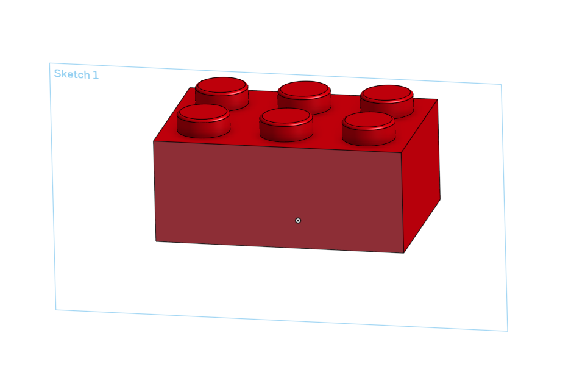
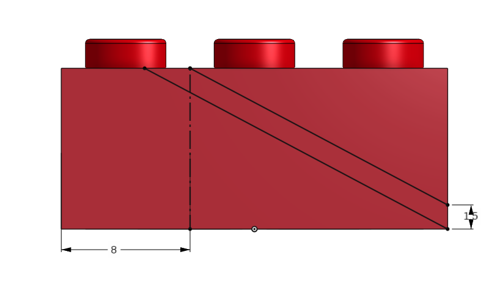
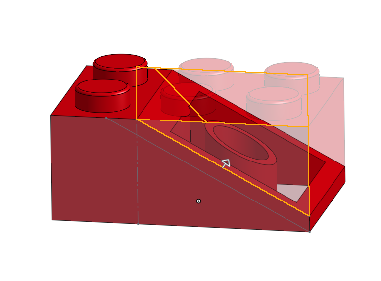
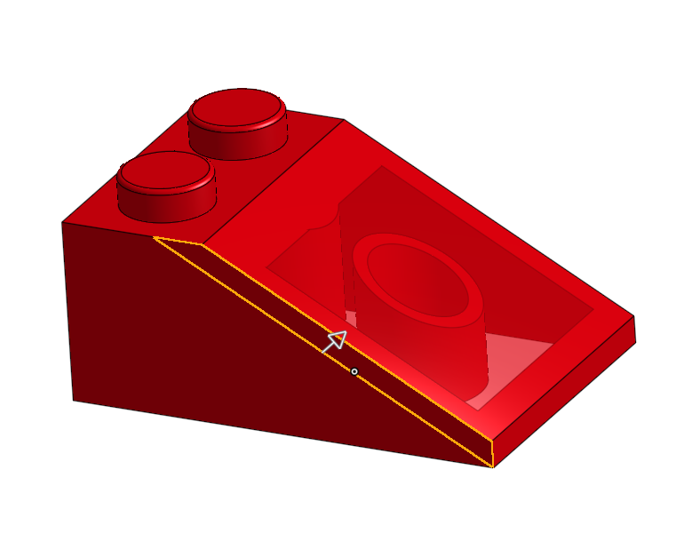
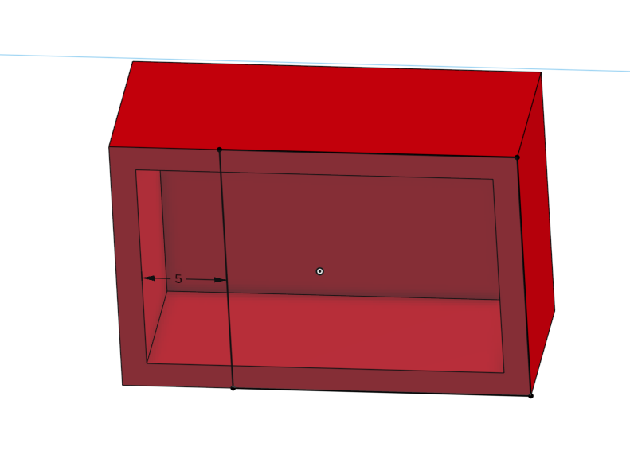
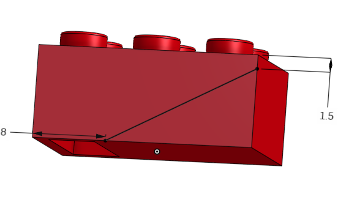
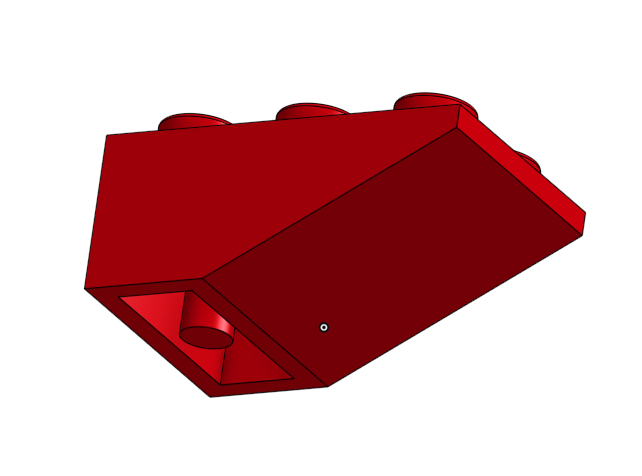

# Slant

If you want to follow along in the parts studio, here is a link to my [original document](https://cvilleschools.onshape.com/documents/18c55e9aeb64057e8e0fbb6a/w/5c06b8e3c4dcf6e948152fa4/e/18df3578f02c775cfcadaef9?configuration=List_8xTqWDMkkCG2Mw%3D_2x2%3BList_ArQ6GsCPNSkQoQ%3DDefault%3BList_Izy0ldJ6UfParG%3DDefault%3BList_tmPjPdZ9wrB2lD%3DDefault&renderMode=0&uiState=6290d24be366b652b2773d0f). Navigate to the Square Bricks folder and find the Part Studio called Slant. 

### Lets Begin

To start make a copy of your original parts studio with the bricks. You can make this in your original parts studio as well, but the more you do this, the more convoluted your part studio is and the assemblies get laggier. 

Making slants is actually very simple. I would recomend designing this on the 2x3 or 1x3 brick. If you are following along in the parts studio ignore Slant Corners. I had those working at one point, but they're broken and I don't feel like fixing them. You can go through and see what I did, but I don't intend to make them work again. 

First make a sketch on the front face of your brick. Like So:

Next draw a verticle construction line connecting the top and bottom of your part and dimension it 8mm away from the left edge

Then draw two lines. One starts at the top of the conntruction line and ends at the right edge. Dimension it so that its #Unit away from the bottom right corner. The second begins at the bottom Right corner and is parrallel to the first. 

(If you're following along in the parts studio you'll notice that I have two sketches and one of them is really weird. Ignore it.)

Next draw a corner rectangle whose bottom two corners are the top of the construction line and the top right corner. Dimension it's height to be any number greater than #Stud_Height. 

Extrude Remove (up to face of the opposite side) the rectangle and the triangle made by the top parrallel line. 

Finally extrude add (up to face of the opposite side) the parrallelagram created by the two parrallel lines. 

And there you go now you have a slant that works on any configurations. 

# Inverse Slants

If you are following along in document navigate to the Inverse Slants parts studio.

### Lets Begin Again

I would once again recommend making a copy of the original parts studio. You can also delete the bottom cylinder and Tube features because they're never used in this part.

First make a Sketch on the bottom face of the brick and draw a Rectangle with it's left side 5mm from the left edge and the rest of the sides coincident with the brick. 

Extrude Add the Rectangle up to the inside of the brick. 

Next sketch on the front face of your brick. Draw a line from the bottom edge to the right edge. The lines bottom point should be 8mm away from the left edge and #Unit away from the top edge. 

Extrude remove (up to face of the opposite side) the bottom triangle created by the new sketch. 

It might look like the part is now complete but we're still missing something. 

Create a sketch on the inside face of the brick. Then create the cylinder feature use in 1 by X bricks. 

Your final part should look like this: 

So now you have two new kinds of bricks. Congratulations! 

The tutorial is over so if thats all you care about you can leave. 
I'm just going to walk you through a bit of the design process and why I made the choices I made.

### Designing Slants

As you now know the Slants are very simple, but I still think it might be helpful to share what I was thinking as I designed them. 

I first had to determine the height of the slant ending from the bottom of the part. This is when I first created Unit. That magical variable that defined much of my designs. 

I then determined that the remaining part of the studs on the top of the brick was just one #Length or 8mm.  
It was a simple as drawing a line connecting the two points. 

The next issue came from the remaining studs. Removing the part that connected them to the brick made them into their own parts. I could delete them but every time I made the brick expand I would have to delete more parts. 

The obvious solution is to change the variable table. Unforchunantly this doesn't work as the base dimensions of the brick change along with the pattern. We could very easily change this but that would involve adding new variables and the easiest solution ended up being to just remove the Studs along with the Slant. 

Then its just a second line to fill in the slant and boom We're done. 

### Designing Inverse Slants

Basically the exact same process is true for inverse slants as it is for slants. 

I filled in the hollow so that there wouldn't be a pocket when I added back and slant and we redesigned the cylinders to work length-wise instead of width-wise. 
