# Technic

If you want to follow along in the parts studio, here is a link to my [original document](https://cvilleschools.onshape.com/documents/18c55e9aeb64057e8e0fbb6a/w/5c06b8e3c4dcf6e948152fa4/e/18df3578f02c775cfcadaef9?configuration=List_8xTqWDMkkCG2Mw%3D_2x2%3BList_ArQ6GsCPNSkQoQ%3DDefault%3BList_Izy0ldJ6UfParG%3DDefault%3BList_tmPjPdZ9wrB2lD%3DDefault&renderMode=0&uiState=6290d24be366b652b2773d0f). Navigate to the technic folder and open the technic pins part studio. You might have to navigate to all tabs first because I'm pretty sure the link puts you into the square bricks folder. 

## Lets Begin

Right off the bat I have a confession to make. 

I only ever got Technic pins working one way. This tutorial will teach you how to make technic pins and other similar things, and more importantly how to make bricks that are cross compatible with actual lego technic peices. But this is a warning. 

#### THE TECHNIC PINS NEED TO BE CHANGED SLIGHTLY TO WORK WITH REAL LEGOS!

## Ok with that out of the way lets actually begin. 

Here is what I'm talking about when I say [Technic Pin](https://www.bricklink.com/v2/catalog/catalogitem.page?P=2780#T=C)

Begin by sketching a center point circle on the origin and dimensioning it 5mm + #Unit (6.5mm)

Extrude add it #Half_Unit(0.75mm)

Then sketch a second center point circle on your disk and dimension it 5mm. 

Extrude it up (8 * #Rows)mm - #Half_Unit(7.25mm). 

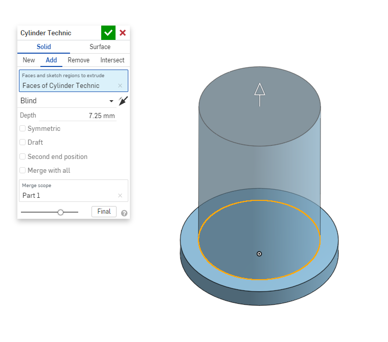

I highly recommend using the variable equations because if you end up changing #Unit in the future your parts studios will update with you. I also find it helpful to understand how I arrived at a number after the fact. 

In this case I relized that the Technic Pins would best be designed around a mirror and that each length of half of the pin needed to be equal to 8mm because they end up perfectly connecting two [1x2 Technic Bricks](https://www.bricklink.com/v2/catalog/catalogitem.page?P=3700#T=C). 

This means that the total length of a technic pin is 16mm because that is the width of a 1x2 brick. 

Anyway tangent aside lets get back to the part. 

Sketch another center circle on the new extrusion and dimension it equal to #Rod_Thickness(4mm)

#### (Rod_Thickness also requires futher testing and it's just a place holder)

Extrude remove the sketch up to the bottom of the 6.5mm circle

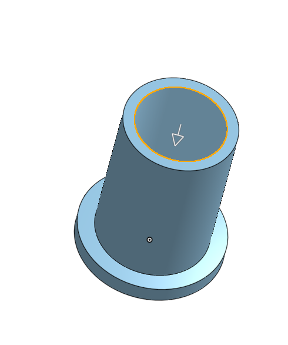

Next create yet another centerpoint circle on the top of the pillar and dimension it so thats its 0.25mm larger than the circle. Then extrude only the outside ring #Half_Unit/2 or 0.375mm 

This creates a small lip that allows the technic pin to stay secure. 

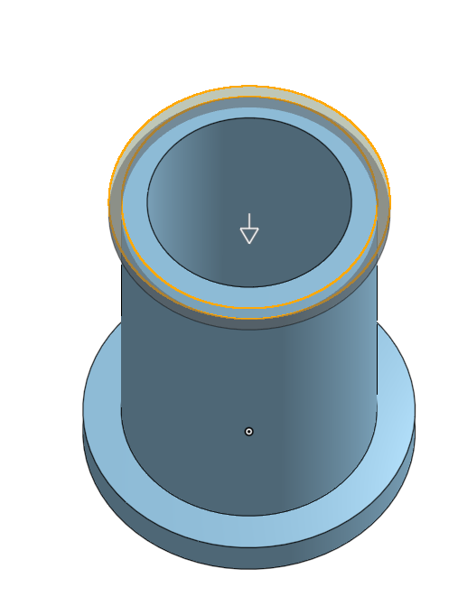

Now we're going to make the part of the technic pin that doesn't work. 

It doesn't work not because of a bad design but simply because the materials used in a 3d printer aren't quite the same as an actual legso. 

The design is acurate but the material isn't flexable enough. To fix this you will probably have to make the divets in the pins wider to allow the pin to flex better. 

#### For now, I would recommend following the guide and changing dimensions later.

Create a Sketch on the lip of the Technic Pin. 

Draw a horizontal construction line from the center of the circle to the edge. Then draw two horizontal lines on the lip of the pin symmetric around the center line and #Half_Unit away from each other. 

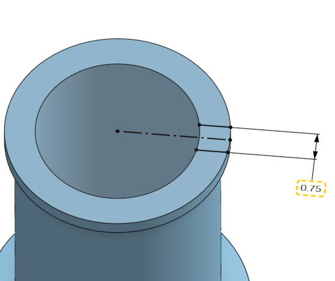

Extrude remove the new sketch a very specific number: #Unit * 2 + #Half_Unit * 1.33 or 3.998mm 

Just trust me on this one cause I don't remember why I chose this to be the distance but I'm like 85% sure it's pretty close to correct. 

Finally mirror the extrude remove over whatever plane works to make it show up on the other side of the lip. For me it was the right plane

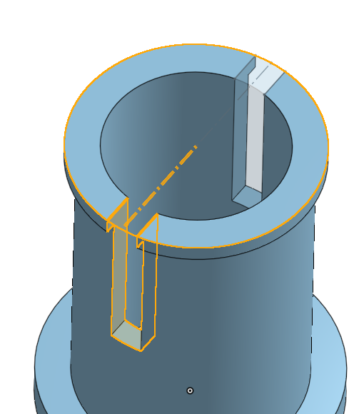  

We're are now going to do exactly what we did on the top of the pin but on the bottom. 

Make a sketch on the bottom of the pin and draw a Verticle construction line this time. 

Draw two verticle lines on the edge and dimension them to be #Half_Unit away and symmetric around the construction line

Extrude remove the new feature #Unit * 1.75 or 2.625mm. Once again don't ask why; I don't remember. 

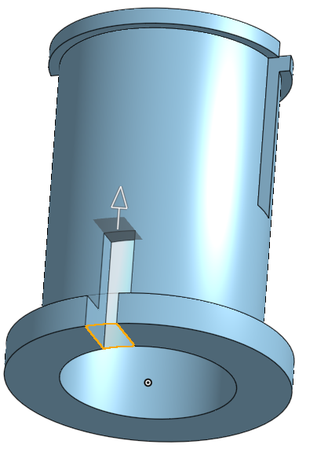  

Mirror the extrusion over the plane perpendicular to the plane used for the first mirror. 

For me that was the Front plane. 

Finally we're going to add fillets

Select the edges of the four flex extrusions that touch the wall and the outside edge of the bottom disk. Dimension it to be #Half_Unit/2 or 0.375mm 

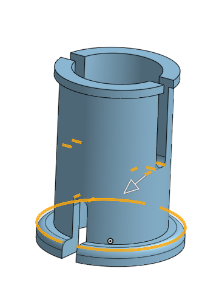  

Make a new fillet and select the bottom and top edges of the top disk and dimension it equal to 0.25mm 

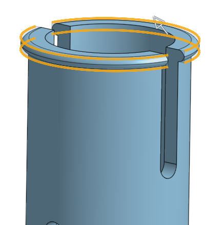  

Finally Finally part mirror your part over the intial plane you sketched on. For me this was Top plane

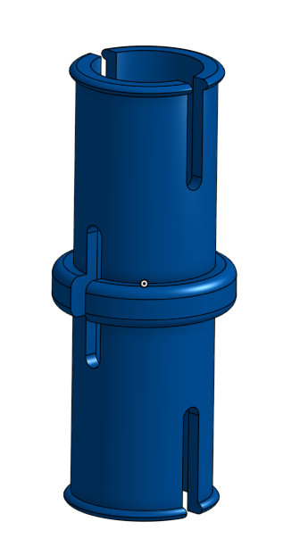  

Congrats you have a Technic Pin! The Reflection for this part is at the very end of the document.

# Axel 

To follow along in the document, change the configuration type to half axel and open up the axel folder at the bottom of the feature list. 

## Lets Begin Again 

I would highly recommend making this part a configuration, but you can also just make a copy of the Technic Pin document. 

If you choose to do configurations than these are the features we're going to configure. If you just make a copy then just make these changes normally. 

First suppress the part mirror

Next change the face of the extrude remove that creates a hole through the center of the part from the bottom of the disk to the top of the disk 

And Finally suppress the extrude remove that cuts out a section from the middle of the part 

Your part should now look like this: 

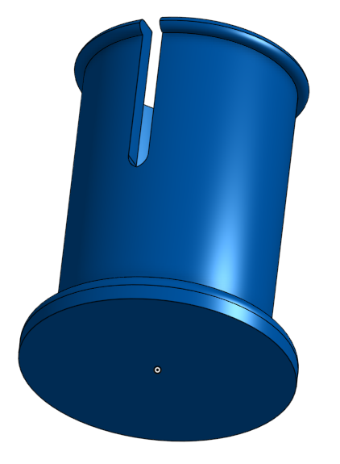

Now make a sketch on the bottom of the bottom disk

Make a centerpoint circle with a radius of 5mm 

Then draw two contruction lines, one verticle and one horizontal, from edge to edge of the circle and passing through the origin. 

Like so: 

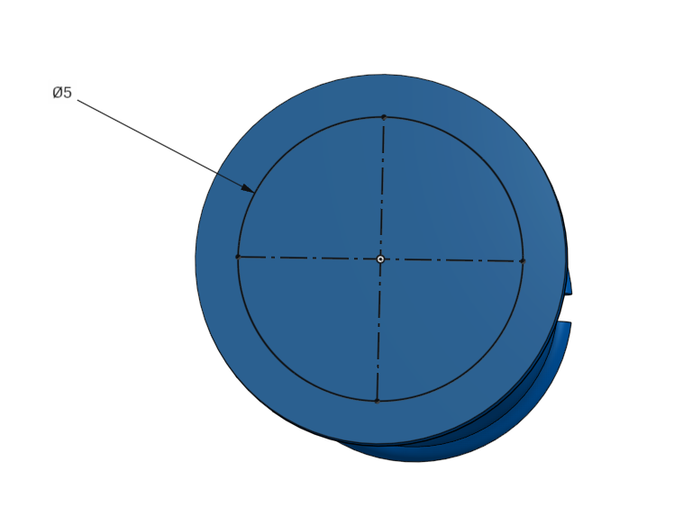

Now draw two verticle lines from the top of the circle on either side of the verticle construction line. Make sure their end points match up. 

Make them symmetric around the construction line. 

Do the same at the bottom of the circle. (You don't have to make them symmetric as long as you make sure that when you create the lines there is a orange dotted line extending from the top line. This will create a relation as you create the line without you having to do it yourself.) 

Dimension the sets of lines so that they are (#Half_Unit/2) + #Unit away from each other or 1.875mm 

If you've done it correctly you should only need to dimension one set of lines 

Now repeat this process for the horizontal construction line. 

You should end up with a sketch that looks like this: 

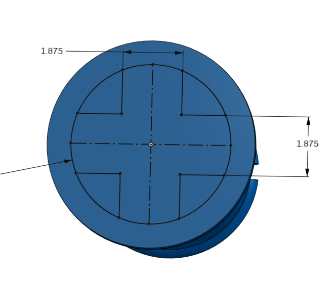

Now extrude out the sketch 8mm 

Finally we're going to make two fillets

A 0.25mm fillet on the four corners where two crosses of the axel meet and a 0.5mm fillet on the four edges of the top of the Axel. 

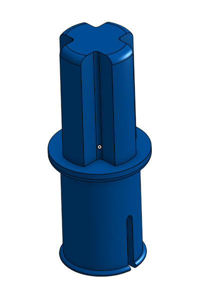

Yay now you have an Axel! The Reflection will be at the end of this guide with the reflection for the technic pin.

# Technic Holes 

To follow along switch to the Lift Arm part studio within the technic folder. 

## Lets Begin Again Again

I'm not going to teach you how to make any specific part; just how to make the holes that technic pins and Axels fit into, 

It's very easy 

### Technic Pin

Create a circle thats 5mm and a second circle thats 6.5mm. 

Extrude the first circle through all and the second circle #Half_Unit 

Then Mirror the second extrusion over the part and boom you have a piece compatable with technic pins 

### Axel 

Just recreate the Axel Sketch but extrude remove it instead of adding it. 

Here's an example of a part using both 

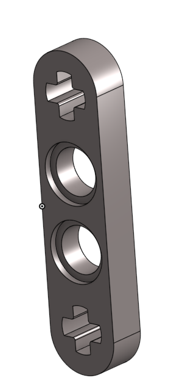

It's really just that easy 

## Reflection 

Here's a little bit of my thought process when designing each part in this guide 

### Technic Pin 

When making the part I decided to build it around a mirror because I knew I was going to have several different kind of technic pins and I wanted a part that could pretty easily switch back and forth between the different kinds. 

I only ended up making two, but I've set it up to be really easy to make more if I wanted to. 

As mentioned in the guide, I already knew how tall each half of the technic pin would be and I used my trusty [Side Plate](https://www.bricklink.com/v2/catalog/catalogitem.page?P=44728&ccName=6117972#T=C&C=85) to determine that the center part of a technic pin was #Unit which means half would be #Half_Unit.

The dimensions of the cut outs were just arbitrary numbers and I just chose them cause they looked pretty close to an actual technic pin. 

The Fillets were also just random numbers that looked right. 

If I were to make this part again I would definently focus on functionality over looking as close to a lego technic pin as possible. 

### Axel

The Dimensions of the Axel sketch were determined through a lot of trial and error

The biggest stratgey I learned from it was to test as many features as possible when printing out pieces. 

Of course don't test multiple overlapping things, but I actually first made the Axel Sketch when designing [Circles](Circles.md)

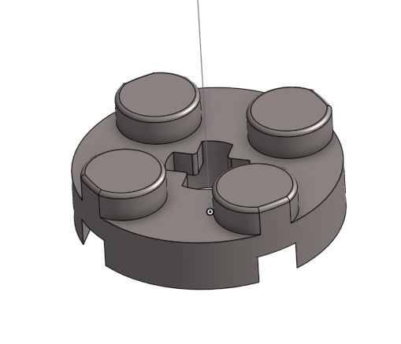

Whenever I was printing out a new circle to test I would also change the axel sketch to try and make it work. 

Two birds with one lego 

### Technic Holes 

I don't really know what to say about this one. 

It's very self explanatory I just felt like I should include it. 
