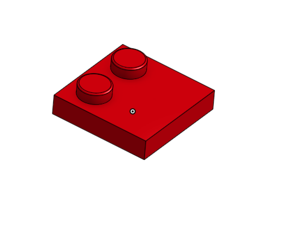
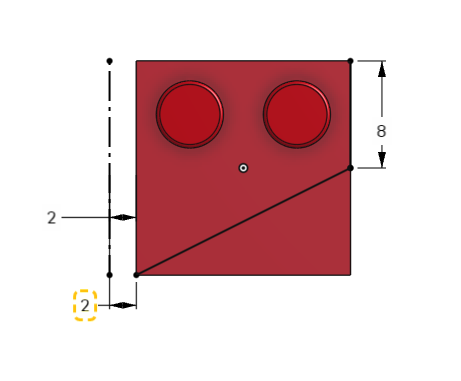

# Wings 

If you want to follow along in the parts studio, here is a link to my [original document](https://cvilleschools.onshape.com/documents/18c55e9aeb64057e8e0fbb6a/w/5c06b8e3c4dcf6e948152fa4/e/18df3578f02c775cfcadaef9?configuration=List_8xTqWDMkkCG2Mw%3D_2x2%3BList_ArQ6GsCPNSkQoQ%3DDefault%3BList_Izy0ldJ6UfParG%3DDefault%3BList_tmPjPdZ9wrB2lD%3DDefault&renderMode=0&uiState=6290d24be366b652b2773d0f). Navigate to the Square Bricks folder and find the Part Studio called Wings. It's towards the back. Change the configurations to Size: 2x2 and Wing: 2x2. You can also roll back the parts studio to right before the plane is added that mirrors the part. 

This is a Guide for my version of the [2x2 Wing](https://www.bricklink.com/v2/catalog/catalogitem.page?P=24299#T=C) (I say my version because it's slightly different from the link), the [3x8 Wing](https://www.bricklink.com/v2/catalog/catalogitem.page?P=50305#T=C), and the [3x3 Triangle](https://www.bricklink.com/v2/catalog/catalogitem.page?P=2450#T=C). I didn't do the [2x3](https://www.bricklink.com/v2/catalog/catalogitem.page?P=43723#T=C) or [2x4](https://www.bricklink.com/v2/catalog/catalogitem.page?P=41770#T=C), but after this tutorial you'll have the skills to make them on your own. 

## Guide to 2x2

First things first you can duplicate your original lego document for this one. (Every part studio in the Square Bricks Folder was duplicated from the original brick) 

Go into your configurations table and add a new configuration input called wings. Name one of your rows wings and the other false. 

Now configure the 2nd direction instance count of your top studs pattern. And change it from "#Rows" to "#Rows - 1" 

Your part should look like this: 

Ok now we're going to make a very weird and somewhat counterintuitive sketch. The reason we're doing this is to make it future proof for the next part and any other parts 

Make a sketch on the top plane. Your two studs should be at the top of the sketch with blank space at the bottom. 

Draw a line from the top right corner of the brick down. Dimension it to be 8mm. 

Draw a verticle construction line in the space next to the left of your brick from the top left corner to the bottom left corner. Dimension it to be 2mm away from the left edge. The top point of the line should match with the top corner of the brick and the bottom point of the line should match with the bottom corner of the brick. 

Ok this next step is incredibly important: Draw a line from the bottom point of the first line diagonally down so that it is coincident with the bottom edge. 

Dimension the bottom point to be 2mm away from your contruction line. 

#### IMPORTANT: Do not make the bottom point of the line and the bottom left corner of the brick coincident. This will break things later.

Now just extrude remove the triangle created by your sketch and boom: You got a 2x2 wing. 

## Guide to 3x8 

Ok first we're going to change some configurations. 

First change your size configuration to 3x8 

Make a new row in your configurations table called 3x8 and change the value for top studs pattern to #Row

Add a new configuration to your table. Go into the 2x2 sketch and configure the distance between the bottom point of the slant and the bottom point of your construction line. Change the value to 18mm. 

I'm sure there's an easier way to do this but just go through and delete the extra parts created by the last sketch. It's these 5:

## Reflection 

### 2x2

I made the executive decision when making this part that it didn't need to be an exact replica of [2x2 Wing](https://www.bricklink.com/v2/catalog/catalogitem.page?P=24299#T=C). All it needed to be was functionally identical which made it a very simple 2 feature part

### 3x8 

The main problem I've encountered on my lego making journey is parts like the Wings that can't be scaled up. 

Just like the [Circles](Circles.md), each time you make a new configuration you have to add a bunch of unique features for that part specifically. 
