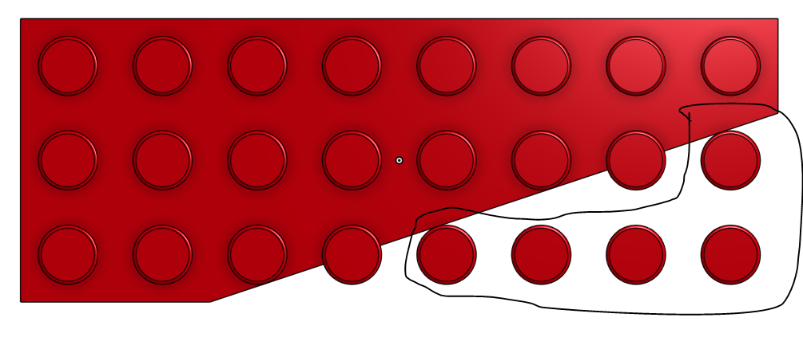

# Wings 

If you want to follow along in the parts studio, here is a link to my [original document](https://cvilleschools.onshape.com/documents/18c55e9aeb64057e8e0fbb6a/w/5c06b8e3c4dcf6e948152fa4/e/18df3578f02c775cfcadaef9?configuration=List_8xTqWDMkkCG2Mw%3D_2x2%3BList_ArQ6GsCPNSkQoQ%3DDefault%3BList_Izy0ldJ6UfParG%3DDefault%3BList_tmPjPdZ9wrB2lD%3DDefault&renderMode=0&uiState=6290d24be366b652b2773d0f). Navigate to the Square Bricks folder and find the Part Studio called Wings. It's towards the back. Change the configurations to Size: 2x2 and Wing: 2x2. You can also roll back the parts studio to right before the plane is added that mirrors the part. 

This is a Guide for my version of the [2x2 Wing](https://www.bricklink.com/v2/catalog/catalogitem.page?P=24299#T=C) (I say my version because it's slightly different from the link), the [3x8 Wing](https://www.bricklink.com/v2/catalog/catalogitem.page?P=50305#T=C), and the [3x3 Triangle](https://www.bricklink.com/v2/catalog/catalogitem.page?P=2450#T=C). I didn't do the [2x3](https://www.bricklink.com/v2/catalog/catalogitem.page?P=43723#T=C) or [2x4](https://www.bricklink.com/v2/catalog/catalogitem.page?P=41770#T=C), but after this tutorial you'll have the skills to make them on your own. 

## Guide to 2x2

First things first you can duplicate your original lego document for this one. (Every part studio in the Square Bricks Folder was duplicated from the original brick) 

Go into your configurations table and add a new configuration input called wings. Name one of your rows wings and the other false. 

Now configure the 2nd direction instance count of your top studs pattern. And change it from "#Rows" to "#Rows - 1" 

Your part should look like this: 

Ok now we're going to make a very weird and somewhat counterintuitive sketch. The reason we're doing this is to make it future proof for the next part and any other parts 

Make a sketch on the top plane. Your two studs should be at the top of the sketch with blank space at the bottom. 

Draw a line from the top right corner of the brick down. Dimension it to be 8mm. 

Draw a verticle construction line in the space next to the left of your brick from the top left corner to the bottom left corner. Dimension it to be 2mm away from the left edge. The top point of the line should match with the top corner of the brick and the bottom point of the line should match with the bottom corner of the brick. 

Ok this next step is incredibly important: Draw a line from the bottom point of the first line diagonally down so that it is coincident with the bottom edge. 

Dimension the bottom point to be 2mm away from your contruction line. 

#### IMPORTANT: Do not make the bottom point of the line and the bottom left corner of the brick coincident. This will break things later.

Now just extrude remove the triangle created by your sketch and boom: You got a 2x2 wing. 

## Guide to 3x8 

Ok first we're going to change some configurations. 

First change your size configuration to 3x8 

Make a new row in your configurations table called 3x8 and change the value for top studs pattern to #Row

Add a new configuration to your table. Go into the 2x2 sketch and configure the distance between the bottom point of the slant and the bottom point of your construction line. Change the value to 18mm. 

I'm sure there's an easier way to do this but just go through and delete the extra parts created by the last sketch. It's these 5:

Now make a sketch on the top of one of the outside studs. Use the Use Relation to create circles the size of these outside studs and then extrude remove them down to face. 

We're almost done with clean up. Make a sketch on the top face of the brick and make two construction lines will cut off the remaining studs. Extrude remove and your part should look like this: 

Flip the brick over and extrude remove the two tubes that have mostly been cut off 

Ok here comes the fun part where everything can break because we're going to use the "Use Relation"!

First thing you want to do is make the sketch right after we deleted all the extra parts visible. It's the one removing the top studs. 

Select the four circles and click on "Use" (The keyboard shortcut is 'U'). We're also going to select the bottom of the stud at the end of the middle row, and inner circle of the two partially cut off tubes. 

Make a diagonal line from the top edge of the brick to the right edge. Make it parallel to the diagonal edge and dimension #Unit(1.5mm) away. 

Ok now we're going to make several lines. 

First: a line from the intersection of diagonal line and the top left circle, perpendicular to the diagonal edge, ending at the diagonal edge. 

Now make a line from the intersection of the circle next to the top left circle and the diagonal edge. Make a second line parallel to it and dimension it #Unit(1.5mm) away. 

Make another line on the other side of the same circle. Make a forth parallel line and dimension it to be (16mm - #Unit * 2) or 13mm. It should look like this: 

Finally make another two lines on both sides of the bottom right circle. Make another line to the left of the left line and dimension it to be #Unit(1.5mm) away. 

You may also need to add the edges of the brick to your part through the "Use Relation"

Extrude the sketch like this:

Ok just a bit of clean up and we're done 

Make a sketch on bottom of the new extrude we just made. Use the diagonal line from the previous sketch then draw lines to cut off the parts of the tubes that stick out into the negative space created by our previous extrusion. While you're at it remove the triangle at the top of the part too. 

Your final part should look like this: 

 

I'll let you figure out mate connectors on your own, and I would recommend mirroring the part over a plane so that you have both versions. 

## Guide to 3x3 

This part is in another part studio. Navigate to the Triangles part studio, it should be right next to Wings 

If you're following along with the document Change the size to 3x3 and open the triangle folder. Ignore the fact that it's red and giving a bunch of errors. That's because the features for 4x4 and 8x8 are also in there. 

We're ready to begin. 

## Reflection 

### 2x2

I made the executive decision when making this part that it didn't need to be an exact replica of [2x2 Wing](https://www.bricklink.com/v2/catalog/catalogitem.page?P=24299#T=C). All it needed to be was functionally identical which made it a very simple 2 feature part. 

### 3x8 

The main problem I've encountered on my lego making journey is parts like the Wings that can't be scaled up. 

Each time you make a new configuration you have to add a bunch of unique features for that part specifically. Everytime you make a new configuration all the features of the previous ones have to suppressed and a bunch of new features must be created. It's why the part studio from [Circles](Circles.md) has 88 features. Each time I made a larger circle I had to remove the changes of the first. Thats ultimately why I only did the 2x2 and 3x8. It just would've taken forever to do more espically since I also included the [3x3 Triangle](https://www.bricklink.com/v2/catalog/catalogitem.page?P=2450#T=C).

### 3x3 
